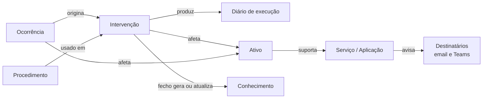
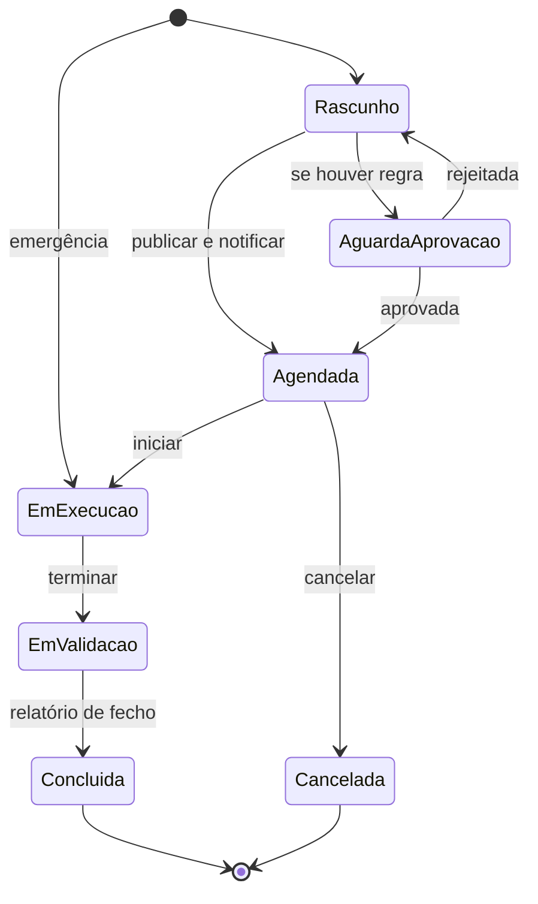
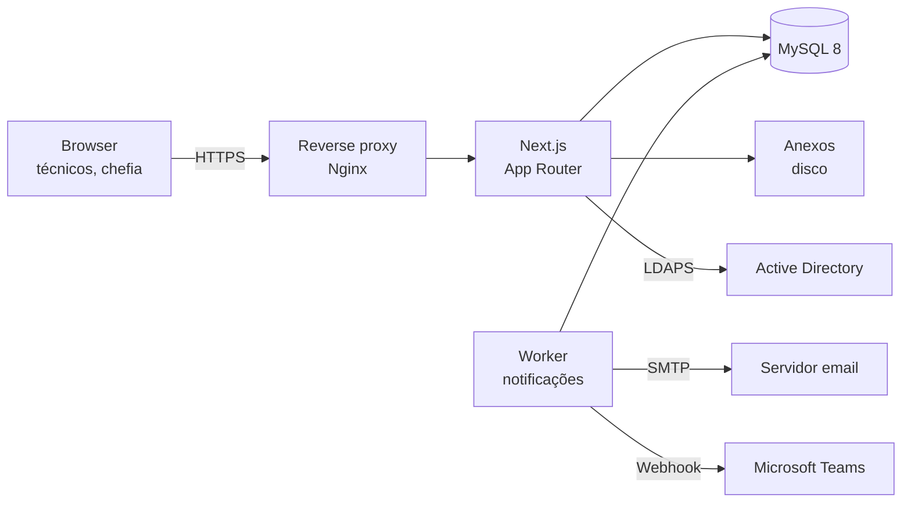

# Plataforma de Gestão de Operações DSIC — Requisitos

Sep 23, 2026 · @Filipe Baptista De Almeida

## Enquadramento

A plataforma garante que nenhuma intervenção técnica na infraestrutura da CMG acontece sem registo nem aviso a quem é afetado. Hoje, reinícios de servidores e atualizações feitos sem aviso entre áreas da DSIC provocam quebras de transações e risco de dados corrompidos no ERP e plataformas associadas.

**Áreas da DSIC envolvidas:** networking (redes, servidores, sistemas operativos, comunicações), plataformas web e externas, helpdesk, ERP e plataformas associadas (urbanismo, educação, etc.).

**Objetivos:**

1. Registar todas as intervenções, planeadas ou não, num diário de operações.
2. Notificar automaticamente as áreas e serviços afetados, com base num inventário de dependências.
3. Permitir reconstituir no futuro o que aconteceu, quando, por quem e porquê.
4. Transformar cada intervenção concluída em conhecimento reutilizável (runbooks e artigos).

**Princípios:** leveza acima de tudo (registar tem de ser mais rápido do que não registar); registo imutável; notificação sem burocracia (aprovação opcional, desligada por omissão); tudo configurável pelo administrador; dados estruturados desde o início para permitir IA numa fase 2. Referência conceptual: Change Enablement, Incident Management e Knowledge Management do ITIL 4.

## Âmbito e fases

A fase 1 entrega o diário de operações completo, com inventário, notificações e base de conhecimento; a IA fica para a fase 2.

| Fase | Inclui |
| --- | --- |
| 1 — Diário de operações | Intervenções (incluindo emergências e aprovação opcional), ocorrências, procedimentos, registos de atividade, diário de execução, inventário de ativos e dependências, processos críticos, janelas protegidas, pré-verificações por risco, confirmação de reposição pelos afetados, notificações email e Teams, relatório de fecho, artigos de conhecimento, calendário, dashboard, linha temporal por ativo, relatórios PDF/Excel, auditoria imutável |
| 2 — Conhecimento e comunicação | Pesquisa semântica e perguntas em linguagem natural (IA), página de estado interna sem login, aviso ao helpdesk com guião de resposta, revisão periódica de procedimentos com dono, variáveis nos procedimentos, análise pós-ocorrência sem culpa com ações corretivas |
| 3 — Integrações | API para registo automático por scripts, integração com a monitorização (modo de manutenção e ocorrências a partir de alertas), descoberta de ativos (vCenter/Hyper-V, AD), indicador de incidente de segurança com prazos de notificação |

**Fora de âmbito na fase 1:** aprovação obrigatória de todas as mudanças (existe apenas aprovação opcional por regra), acesso de outros serviços à plataforma (apenas recebem avisos), SMS, execução automática de procedimentos nos servidores. Fora de âmbito em qualquer fase: CMDB exaustiva e comité formal de mudanças (CAB).

## Perfis e autenticação

Os perfis são conjuntos pré-definidos de permissões (RBAC) que o administrador pode ajustar ou complementar. A plataforma serve a DSIC (cerca de 20 técnicos, sem limite técnico); os outros serviços da CMG não têm conta e só recebem avisos.

| Perfil pré-definido | Permissões por omissão |
| --- | --- |
| Administrador | Tudo, incluindo utilizadores, perfis e permissões, áreas, inventário, destinatários, templates, SMTP, webhooks, regras de aprovação e parâmetros; nunca apagar registos nem auditoria |
| Chefia | Ler tudo; dashboard, relatórios e exportações; aprovar intervenções quando a aprovação estiver ativa |
| Técnico | Criar e editar intervenções, ocorrências, registos de atividade e procedimentos; executar; gerir ativos das suas áreas; sinalizar conflitos |
| Consulta / Auditor | Consultar registos, calendário e conhecimento; consultar a auditoria, se atribuído |

**Permissões atómicas:** ver, criar, editar, executar, cancelar, aprovar, gerir procedimentos e conhecimento, administrar ativos, consultar auditoria, exportar, administrar sistema. Podem ser limitadas às áreas do utilizador.

**Áreas:** configuráveis (ex.: Networking/Infraestruturas, ERP e aplicações associadas, Helpdesk, Web/Plataformas externas). Um utilizador pode pertencer a várias áreas e ser marcado como responsável de uma área, o que o torna aprovador dessa área.

**Autenticação híbrida:**

- **Active Directory (LDAP/LDAPS)** desde a fase 1 para os técnicos da CMG: bind com conta de serviço, filtro por grupo AD configurável, mapeamento opcional grupo AD → perfil.
- **Contas locais** para exceções (ex.: fornecedores, conta de emergência do administrador se o AD falhar): palavra-passe com hash Argon2id ou bcrypt, política de complexidade configurável.
- **Microsoft Entra ID (SSO)** como opção futura, sem alterar o modelo de utilizadores.
- **MFA (TOTP)** obrigatória para contas locais e para o perfil Administrador.
- Bloqueio temporário após N tentativas falhadas; sessões com expiração por inatividade configurável.
- Utilizadores AD são criados no primeiro login (just-in-time) mas ficam inativos até o administrador lhes atribuir perfil, ou recebem um perfil por omissão configurável.

## Modelo de domínio

O núcleo é o grafo ativo → serviço → destinatários: é ele que decide quem é avisado quando um ativo sofre uma intervenção.

Cada intervenção ou ocorrência afeta um ou mais ativos; a plataforma percorre as dependências e junta os destinatários de todos os serviços atingidos.

| Entidade | Campos principais |
| --- | --- |
| Área | Nome, email e canal Teams da área; membros (um utilizador pode estar em várias) com indicação de responsável |
| Ativo | Nome, tipo (servidor físico, VM, base de dados, aplicação, equipamento de rede, serviço externo), hostname/IP, ambiente, SO e versão, área responsável, criticidade, janela de manutenção preferencial, estado |
| Dependência | Ativo origem, ativo destino, tipo (corre em, usa base de dados, autentica em, rede) |
| Serviço / Aplicação | Nome (ex.: ERP, Urbanismo, Educação), ativos que o suportam, destinatários, criticidade |
| Destinatário | Nome, tipo (pessoa, lista de distribuição, canal Teams), email ou webhook |
| Intervenção (INT-) | Código, categoria, título, descrição, motivo, responsável, participantes, início e duração previstos, ativos afetados, risco, impacto, emergência (sim/não), procedimento usado, plano de rollback, ocorrência de origem, estado |
| Entrada do diário de execução | Intervenção, data/hora, autor, texto, anexo opcional |
| Aprovação | Intervenção, regra aplicada, aprovador, decisão, comentário, data/hora |
| Ocorrência (OCR-) | Código, título, descrição, ativos afetados, início detetado, fim, impacto, severidade, causa, ações tomadas, intervenção que a causou, estado |
| Registo de atividade (ATV-) | Código, texto, data/hora, autor, ativos e registos relacionados, etiquetas |
| Procedimento (PRC-) | Código, título, objetivo, pré-requisitos, passos e comandos, validações, rollback, valores por omissão (categoria, risco, impacto, duração, destinatários), versão |
| Relatório de fecho | Resultado (sucesso, parcial, falhou, revertido), início e fim reais, desvios face ao previsto, lições aprendidas |
| Artigo de conhecimento (KB-) | Código, título, problema, solução, registos de origem, ativos, etiquetas, versão |
| Conflito sinalizado | Registo, autor, motivo, resolução |
| Anexo | Ficheiro, tipo, tamanho, hash SHA-256, registo associado, autor |
| Evento de auditoria | Quem, quando, ação, entidade, versão anterior e nova, IP, hash encadeado |

Risco e impacto usam escalas independentes (Baixo, Médio, Alto, Crítico): o risco mede a probabilidade de algo correr mal, o impacto mede as consequências para os serviços se correr.

**Entidades de salvaguarda:**

| Entidade | Campos principais |
| --- | --- |
| Janela protegida | Nome (ex.: processamento de vencimentos, fecho de contas, matrículas), período ou regra de recorrência, serviços ou ativos abrangidos, tipo (congelamento: só emergências; ou aviso) |
| Processo crítico | Nome (ex.: integração EDI noturna, backup, batch do ERP), serviço e ativos, horário e recorrência, duração típica |
| Pré-verificação | Texto (ex.: snapshot da VM feito, backup verificado, sessões ativas avisadas), nível de risco a partir do qual é obrigatória, categorias aplicáveis |
| Confirmação de reposição | Intervenção, serviço, destinatário, resposta (Serviço OK / Há problemas), comentário, data/hora, ocorrência criada |

## Requisitos funcionais

Os requisitos estão numerados (RF) para serem referidos nos commits e nas tarefas do Claude Code.

**Ciclo de vida de uma intervenção**

Sem regras de aprovação ativas, o caminho é Rascunho → Agendada → Em execução → Em validação → Concluída. O resultado (sucesso, parcial, falhou, revertido) fica no relatório de fecho; reagendar gera nova notificação.

**Intervenções**

- **RF01** Criar intervenção. Obrigatórios: título, categoria, motivo, responsável, início, duração prevista, ativos, risco e impacto. Plano de rollback obrigatório a partir de risco Médio (configurável). Restantes campos opcionais.
- **RF02** Código legível automático por tipo de registo (ex.: INT-2026-0042, OCR-, ATV-, PRC-0021, KB-).
- **RF03** Risco e impacto em escalas independentes; o impacto é sugerido pela criticidade dos serviços atingidos e pode ser alterado.
- **RF04** Ao escolher ativos, mostrar de imediato o impacto calculado: serviços atingidos e destinatários.
- **RF05** Acrescentar ou retirar destinatários manualmente, com justificação registada.
- **RF06** Validar aviso mínimo configurável (ex.: 24 h); abaixo dele só é possível avançar como emergência.
- **RF07** Intervenção de emergência: pode ser registada durante ou depois da execução, notifica os afetados e a chefia de imediato, dispensa aprovação prévia e exige documentação completa num prazo configurável (ex.: 24 h), com lembretes até estar completa.
- **RF08** Detetar sobreposições nos mesmos ativos ou serviços, e intervenções fora da janela de manutenção do ativo, dentro de uma janela protegida ou em coincidência com um processo crítico (RF32, RF33), e avisar o autor.
- **RF09** Qualquer técnico pode sinalizar um conflito numa intervenção agendada; o autor é notificado e regista a resolução. Não bloqueia a intervenção.
- **RF10** Criar intervenção a partir de um procedimento, herdando os valores por omissão, passos, validações e rollback; os procedimentos funcionam como modelos (não há um conceito de template à parte).
- **RF11** Diário de execução: entradas cronológicas com hora, autor, texto e anexo opcional; início e fim registados automaticamente.
- **RF12** Validação pós-execução: checklist de verificação (herdada do procedimento) antes de concluir.
- **RF13** Intervenções recorrentes (ex.: patching mensal, manutenção trimestral) com regra de recorrência.
- **RF14** Aprovação opcional, desligada por omissão: o administrador define regras por categoria, risco ou impacto (ex.: "risco Alto ou Crítico"). Aprovadores: chefia ou responsável da área dos ativos, conforme a regra. A notificação aos afetados só sai após aprovação; rejeição exige comentário. Em emergências, a aprovação é feita a posteriori.

**Ocorrências**

- **RF15** Registar ocorrência, incluindo a posteriori, com estados Aberta → Em análise → Em resolução → Resolvida → Encerrada.
- **RF16** Notificar os afetados na abertura (opcional) e obrigatoriamente na resolução.
- **RF17** Criar uma intervenção a partir de uma ocorrência (fica "originada por"), e ligar uma ocorrência à intervenção que a causou.

**Registos de atividade, procedimentos e conhecimento**

- **RF18** Registo de atividade rápido (texto, ativos, etiquetas) para trabalho sem workflow. Pergunta obrigatória "implicou ou implica indisponibilidade?"; se sim, a plataforma converte-o em intervenção (de emergência, se já ocorreu).
- **RF19** Procedimentos em editor Markdown, versionados; cada versão é preservada.
- **RF20** Relatório de fecho obrigatório para concluir intervenções e encerrar ocorrências.
- **RF21** No fecho, propor um artigo de conhecimento pré-preenchido; o técnico revê e publica, ou justifica não publicar.
- **RF22** Promover uma intervenção bem-sucedida a procedimento; se o relatório de fecho registar desvios, sugerir atualizar o procedimento usado.

**Inventário**

- **RF23** CRUD de ativos, serviços, dependências e destinatários; desativar em vez de apagar.
- **RF24** Importação inicial do inventário por CSV/Excel.
- **RF25** Vista de dependências de um ativo (o que depende dele e de que depende).

**Transversais**

- **RF26** Pesquisa de texto integral e por código sobre todos os registos, procedimentos e artigos, com filtros por tipo, área, ativo, período, estado, risco, impacto e etiqueta.
- **RF27** Etiquetas livres em todos os registos.
- **RF28** Comentários em registos, também imutáveis.
- **RF29** Anexos em qualquer registo, guardados no servidor.
- **RF30** Correções geram nova versão com motivo obrigatório; histórico de versões visível e comparável.
- **RF31** Configuração pelo administrador: áreas, categorias, tipos de ativo, escalas de risco e impacto, aviso mínimo, prazo de documentação de emergências, regras de aprovação, templates de email e Teams, SMTP, webhooks, políticas de sessão e de anexos.

**Salvaguardas**

- **RF32** Janelas protegidas configuráveis por serviço ou ativo. Em congelamento, só é possível avançar como emergência; nas de aviso, o autor confirma que tomou conhecimento. Visíveis no calendário.
- **RF33** Processos críticos recorrentes registados no inventário; uma intervenção que coincida com um deles mostra o aviso ao autor antes de publicar.
- **RF34** Confirmação de reposição: o aviso de fim de uma intervenção com impacto leva os botões "Serviço OK" e "Há problemas", por link assinado sem login. "Há problemas" pede um comentário curto, cria uma ocorrência ligada à intervenção e notifica o responsável. As respostas ficam no registo.
- **RF35** Pré-verificações obrigatórias por nível de risco e categoria, definidas pelo administrador, marcadas antes de iniciar a execução; os procedimentos podem acrescentar as suas.

## Notificações

As notificações saem por email (SMTP configurável) e Microsoft Teams, para os destinatários calculados a partir do inventário.

| Momento | Quem recebe | Canais |
| --- | --- | --- |
| Intervenção publicada (ou aprovada, se sujeita a aprovação) | Afetados + área responsável | Email + Teams |
| Aprovação pedida | Aprovadores da regra | Email + Teams |
| Aprovação decidida ou rejeitada | Autor | Email + Teams |
| Intervenção reagendada ou cancelada | Afetados + área responsável | Email + Teams |
| Lembrete antes do início (ex.: 1 h, configurável) | Afetados | Email + Teams |
| Início e fim da intervenção (o aviso de fim leva os botões de confirmação de reposição) | Afetados | Teams (email opcional) |
| Emergência declarada | Afetados + chefia | Email + Teams, de imediato |
| Documentação de emergência em atraso | Autor, depois chefia | Email |
| Conflito sinalizado | Autor da intervenção | Email + Teams |
| Ocorrência aberta (opcional) e resolvida | Afetados + área responsável | Email + Teams |
| Resumo diário/semanal das intervenções previstas | Técnicos e chefia (subscrição) | Email |

**Regras técnicas:**

- Fila de envio persistente em base de dados, com tentativas automáticas e registo de cada envio (destinatário, canal, estado, erro). O envio nunca bloqueia a gravação do registo.
- Templates de email e de mensagem Teams editáveis pelo administrador, com variáveis (ativos, serviços, horário, responsável, link).
- Emails com anexo .ics para a intervenção aparecer no calendário Outlook dos destinatários; atualizações e cancelamentos atualizam o mesmo evento.
- SMTP: servidor, porta, TLS/STARTTLS, autenticação, remetente; botão de envio de teste.
- Teams: webhooks por canal via Workflows (Power Automate), com mensagens em Adaptive Card; os antigos conectores Office 365 estão descontinuados.
- Os destinatários externos à DSIC recebem uma versão sem detalhe técnico (hostnames, IPs), apenas o serviço afetado, o horário e o impacto.

## Vistas e relatórios

Quatro vistas essenciais na fase 1, todas com filtros por área, ativo, serviço e período.

| Vista | Conteúdo |
| --- | --- |
| Calendário de intervenções | Mês, semana e dia; cores por área ou criticidade; sobreposições destacadas; exportação iCal subscrevível |
| Dashboard | Intervenções próximas e em curso, ocorrências abertas, emergências por documentar, aprovações pendentes, conflitos por resolver, indicadores do período |
| Linha temporal por ativo | Tudo o que aconteceu a um ativo por ordem cronológica: intervenções, ocorrências, registos de atividade, alterações de inventário |
| Relatórios | Listagens e indicadores exportáveis em PDF e Excel |

**Indicadores do dashboard:**

- Intervenções por área e por tipo no período.
- Taxa de sucesso das intervenções (sucesso, parcial, falhou, revertido).
- Intervenções de emergência em percentagem do total, e as que têm documentação em atraso; distribuição por risco e impacto.
- Ocorrências por ativo e por serviço; tempo médio de resolução (MTTR).
- Ocorrências causadas por intervenções e intervenções originadas por ocorrências.
- Ativos com mais intervenções e incidentes.

**Relatórios pré-definidos:** relatório mensal da DSIC; histórico de um ativo; histórico de um serviço; relatório de uma ocorrência com a cronologia completa (para análise do que aconteceu e porquê).

## Requisitos não funcionais

Segurança e auditoria têm prioridade sobre funcionalidades: a plataforma descreve a infraestrutura crítica da CMG.

**Segurança (RNF01–RNF08)**

- **RNF01** HTTPS obrigatório (certificado interno da CMG), HSTS e cabeçalhos de segurança (CSP, X-Frame-Options, etc.).
- **RNF02** Autorização verificada no servidor em todas as rotas e server actions, nunca só na interface.
- **RNF03** Proteção contra OWASP Top 10: validação de entrada (Zod), queries parametrizadas via ORM, proteção CSRF, sanitização de Markdown.
- **RNF04** Segredos (SMTP, conta de serviço AD, webhooks) cifrados em base de dados (AES-256-GCM) com chave fora da BD; nunca no repositório.
- **RNF05** Rate limiting no login e na API.
- **RNF06** Anexos: lista branca de extensões e tamanho máximo configuráveis, verificação do tipo real, nome aleatório no disco, fora da pasta pública, download só autenticado; análise antivírus (ClamAV) recomendada.
- **RNF07** Dependências auditadas (npm audit / Dependabot) no pipeline.
- **RNF08** Acesso apenas pela rede interna da CMG.

**Auditoria e imutabilidade (RNF09–RNF12)**

- **RNF09** Nenhum registo, comentário, anexo ou evento é apagado; correções criam nova versão com motivo.
- **RNF10** Log de auditoria append-only: logins (sucesso e falha), criações, alterações, exportações, alterações de configuração e de permissões.
- **RNF11** Cada evento guarda o hash do anterior (cadeia SHA-256); verificação de integridade periódica e a pedido do administrador.
- **RNF12** O utilizador MySQL da aplicação não tem permissão de UPDATE/DELETE nas tabelas de auditoria e versões.

**RGPD (RNF13–RNF14)**

- **RNF13** Dados pessoais limitados ao necessário (nome, email, área); validar com o Encarregado de Proteção de Dados da CMG.
- **RNF14** Utilizadores que saem são desativados, não apagados, para manter a rastreabilidade.

**Operação e desempenho (RNF15–RNF20)**

- **RNF15** Páginas principais em menos de 2 s com 5 anos de histórico.
- **RNF16** Backups diários da base de dados e da pasta de anexos, com retenção configurável e teste de reposição documentado.
- **RNF17** Logs aplicacionais estruturados (JSON) e endpoint de health check para monitorização.
- **RNF18** Interface em português de Portugal, responsiva (utilizável no telemóvel durante uma intervenção), acessível (WCAG 2.1 AA).
- **RNF19** Datas e horas guardadas em UTC e mostradas em hora de Lisboa.
- **RNF20** A plataforma não deve ser alojada num servidor que ela própria gere sem aviso: definir o seu próprio procedimento de manutenção.

**Leveza e usabilidade (RNF21–RNF25)**

- **RNF21** Registo de atividade em menos de 30 segundos; intervenção a partir de um procedimento em menos de 2 minutos.
- **RNF22** Formulários curtos: só os campos obrigatórios à vista, o resto recolhido; valores por omissão herdados do procedimento e do último registo semelhante.
- **RNF23** Criação rápida acessível de qualquer página (botão fixo e atalho de teclado); duplicar um registo anterior.
- **RNF24** Nenhum aviso bloqueia sem necessidade: sobreposições, processos críticos e janelas de aviso informam; só o congelamento e as regras de aprovação ativas impedem avançar.
- **RNF25** Links de confirmação de reposição assinados, de uso único e com validade configurável (ex.: 72 h), sem expor detalhe técnico.

## Arquitetura e stack

Uma aplicação Next.js monolítica com um worker separado para notificações, MySQL e armazenamento de anexos em disco, tudo no servidor interno.

| Camada | Proposta |
| --- | --- |
| Linguagem | TypeScript em modo estrito |
| Framework | Next.js (App Router, Server Components, Server Actions) |
| Interface | Tailwind CSS + shadcn/ui; FullCalendar para o calendário; Recharts para o dashboard |
| Base de dados | MySQL 8 com Prisma ORM e migrações versionadas; índices FULLTEXT para pesquisa |
| Autenticação | Auth.js com provider de credenciais (local) e LDAP via ldapts; TOTP com otplib |
| Validação | Zod partilhado entre formulários e servidor |
| Email | Nodemailer, SMTP configurável; ics para convites de calendário |
| Fila e tarefas agendadas | Tabela de fila em MySQL + worker Node.js (lembretes, resumos, verificação da cadeia de auditoria); evita depender de Redis |
| Exportações | ExcelJS para Excel; PDF gerado no servidor (ex.: @react-pdf/renderer) |
| Testes | Vitest (unitários), Playwright (ponta a ponta) |
| Implantação | Docker Compose (app, worker, MySQL) atrás de Nginx, se o servidor o permitir; alternativa: PM2 |

> **Nota (2026-09-24):** a autenticação foi alterada para sessões próprias em base de dados, em vez de Auth.js — ver [ADR 0001](decisoes/0001-sessoes-proprias.md). A versão de MySQL alvo em produção é a 8.4 LTS.

**Repositório e Git:**

- Repositório GitHub ou GitLab privado; ramo main protegido, trabalho em ramos e pull requests.
- Pipeline CI: lint, verificação de tipos, testes, npm audit e build a cada push.
- Conventional Commits com referência ao requisito (ex.: `feat(RF05): detetar sobreposições`).
- Ficheiro `.env.example` sem segredos; ficheiro `CLAUDE.md` na raiz com as convenções do projeto para o Claude Code.
- Fase 2 (IA): o MySQL guarda texto estruturado; a pesquisa semântica pode usar embeddings num serviço à parte ou um modelo local, sem alterar o modelo de dados.

## Plano de implementação com Claude Code

Oito marcos, cada um utilizável e testado antes do seguinte; ao Claude Code dá-se um marco de cada vez, com este documento no repositório.

| Marco | Entrega | Requisitos |
| --- | --- | --- |
| M1 Fundações | Projeto Next.js, Prisma + MySQL, Docker Compose, CI, CLAUDE.md, layout base | Arquitetura |
| M2 Autenticação e acessos | Login local + AD, MFA, RBAC com perfis pré-definidos, áreas e membros, gestão de utilizadores | Perfis, RNF01–RNF05 |
| M3 Auditoria e versionamento | Tabelas de versões, log append-only com cadeia de hash, permissões MySQL | RNF09–RNF12, RF30 |
| M4 Inventário e salvaguardas | Ativos, serviços, dependências, destinatários, processos críticos, janelas protegidas, importação CSV, cálculo de impacto | RF04, RF23–RF25, RF32, RF33 |
| M5 Registos | Intervenções, emergências, pré-verificações, diário de execução, ocorrências, registos de atividade, procedimentos, anexos, comentários, conflitos | RF01–RF03, RF05–RF13, RF15–RF19, RF27–RF29, RF35, RNF21–RNF24 |
| M6 Notificações e aprovação | Fila, worker, SMTP, Teams, templates, .ics, lembretes, confirmação de reposição, regras de aprovação opcional | Notificações, RF14, RF31, RF34, RNF25 |
| M7 Fecho e conhecimento | Relatório de fecho, artigos, promoção a procedimento, pesquisa | RF20–RF22, RF26 |
| M8 Vistas e relatórios | Calendário (com janelas protegidas), dashboard, linha temporal, PDF/Excel | Vistas e relatórios |

**Como trabalhar com o Claude Code:**

- Exportar este documento para Markdown e guardá-lo em `docs/requisitos.md`; referenciá-lo no `CLAUDE.md`.
- Por marco: pedir primeiro um plano (modo de planeamento), revê-lo, e só depois a implementação.
- Exigir testes para as regras críticas: permissões, cálculo de impacto, imutabilidade, cadeia de hash, fila de envio.
- Rever cada pull request antes de integrar, sobretudo autenticação e auditoria.
- Popular o ambiente de desenvolvimento com dados fictícios (seed), nunca com hostnames ou IPs reais da CMG.

## Questões em aberto

- [ ] O servidor interno permite Docker, ou implantação com PM2? Que SO?
- [ ] Qual o aviso mínimo por omissão (24 h, 48 h)? Varia com a criticidade do ativo?
- [ ] Arranca-se com alguma regra de aprovação ativa (ex.: risco Crítico) ou todas desligadas?
- [ ] Prazo para documentar intervenções de emergência (24 h, 48 h)?
- [ ] Lista inicial de categorias de intervenção.
- [ ] Lista inicial de janelas protegidas (ex.: vencimentos, fecho de contas, matrículas) e quais são congelamento.
- [ ] Processos críticos por serviço (batch, backups, integrações) com horários, a recolher junto de cada área.
- [ ] Pré-verificações obrigatórias por nível de risco.
- [ ] Os webhooks do Teams via Workflows estão autorizados no tenant da CMG?
- [ ] Há uma CMDB ou inventário existente para a importação inicial?
- [ ] Que grupos AD mapeiam para cada perfil?
- [ ] Retenção de registos e anexos: indefinida, ou por prazo definido com o arquivo municipal?
- [ ] GitHub ou GitLab, e em que conta/organização da CMG?
- [ ] Parecer do Encarregado de Proteção de Dados sobre os dados pessoais tratados.
